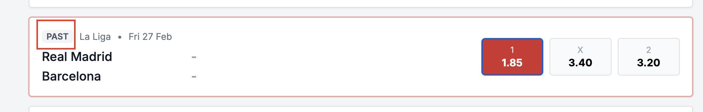
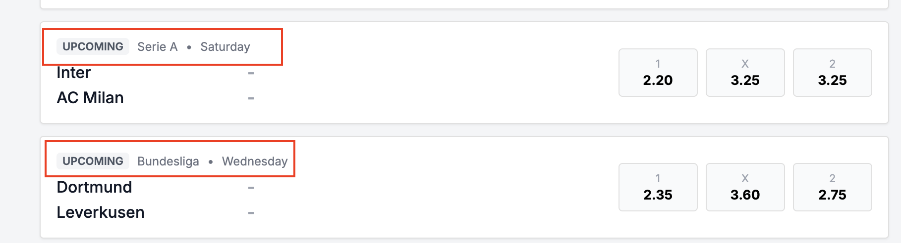
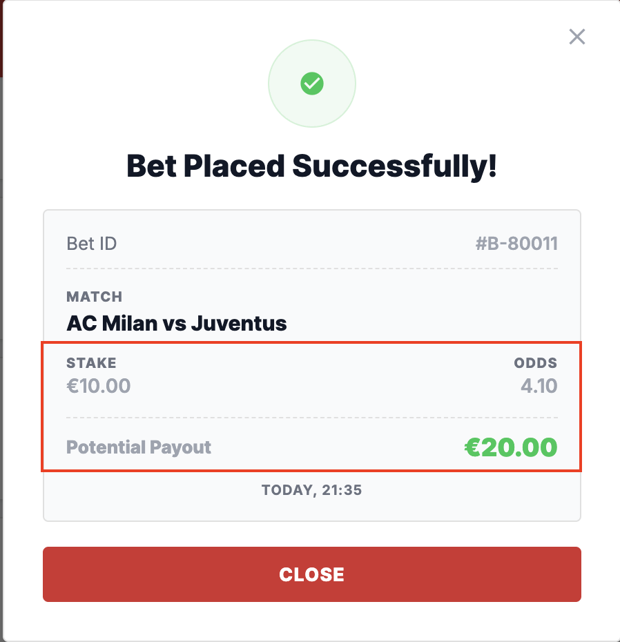
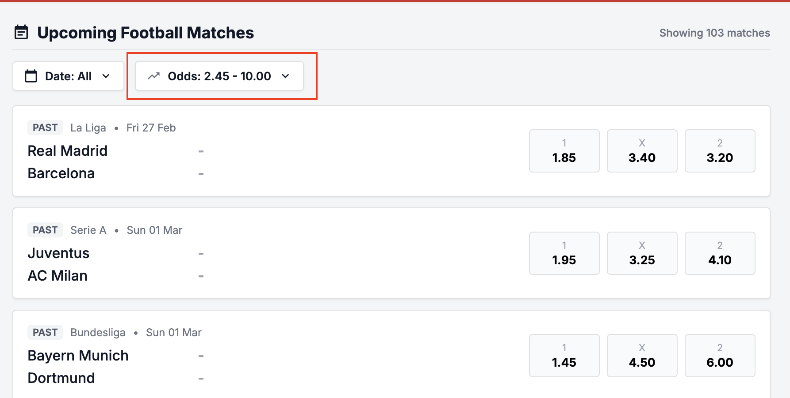
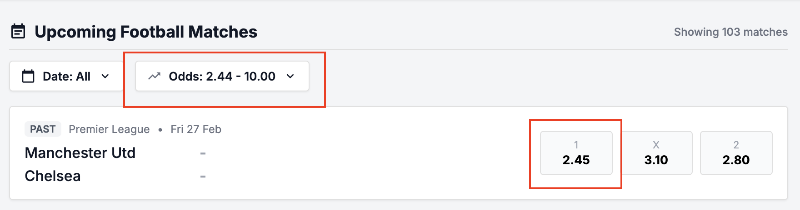

# Found defects: #

# 2.1 Match list:
## bug_001:  Upcoming Football Matches list shows PAST matches
Severity: High
#### Reproduction Steps
1. Navigate to Upcoming Football Matches list
2. Scroll into list view to check available matches
#### Actual result:
- Observe that some of the available matches have status "PAST" (e.g. match: Real Madrid - Barcelona)
#### Expected result:
- Upcoming Football Matches list shows only upcoming matches
#### Business Impact: 
Finished matches for betting may lead to invalid bet submissions, financial inconsistencies,
regulatory violations, and poor user experience.
- It’s possible to make a single bet placement for past matches, no failure outcome.
##### Evidence: 

## bug_002: Kickoff date/time label is not displayed for upcoming matches
#### Severity: Medium
#### Reproduction Steps
1. Navigate to Upcoming Football Matches list
2. Scroll into list view to check available matches
3. Find out match Inter - AC Milan
4. Observe if all match details are properly displayed
#### Actual result:
- Kickoff date/time label is partially displayed, missing date: 
- UPCOMING Serie A • Saturday
#### Expected result:
- Kickoff date/time label consists of contracted day name and exact date:
- UPCOMING Serie A • Sat 02 May
#### Business Impact: 
The missing kickoff date/time label may negatively impact user experience, and betting activity because user cannot
clearly determine when an event starts.
##### Evidence:

# 2.3 Place Bet Interaction
## bug_003: Placing Bet does not reduce user balance synchronously 
#### Severity: Medium
#### Reproduction Steps
1. Check user balance in the header: e.g. Balance: €30.00
2. Select upcoming football match from the match list
3. Click on odds to select outcome for betting
4. Enter stake value €10
5. Place Bet
6. Check if the stake is deducted from user balance value

#### Actual result:
- The balance remains the same until the browser page reloads
#### Expected result:
- If Placing Bet is successfully performed, the balance is deducted by the stake value synchronously. 
- User is able to see the change without reloading the page.
#### Business Impact: 
This is trust-related problem because the displayed balance becomes temporarily inconsistent
with the actual betting transaction state.
##### Evidence:

# 2.4 Success Receipt:
## bug_004: Incorrect Potential Payout
#### Severity: Critical
#### Reproduction Steps
1. Select some upcoming football match: Juventus - AC Milan
2. Click away odds to select outcome for betting, the odds is 4.10
3. Enter the stake value €10
4. Observe that potential payout is correctly displayed within Bet Slip: €41
5. Click Place Bet

#### Actual result:
- Bet Placed Successfully popover is displayed, and potential payout is €20.
#### Expected result:
- Potential payout is €41, due to result of selected odds and stake.
#### Business Impact: 
The issue where the potential payout is calculated incorrectly during bet placement is considered critical because
it directly affects financial transparency, user trust, betting decisions, and regulatory compliance.
##### Evidence:

# 2.6 Filters
## bug_005: Odds filter does not support inclusive min range
#### Severity: Medium
#### Reproduction Steps
1. Observe the odds for match: Manchester Utd - Chelsea (2.45 | 3.10 | 2.80)
2. Open Odds Filter popover to set min value to 2.45; then apply the filter settings
3. Check the matches list

#### Actual result:
- The match (Manchester Utd - Chelsea) disappears from the filtered list of available upcoming matches.
- Minimum value for odds range does not apply inclusively.
- The match is displayed only if min odds range value is: 2.44
#### Expected result:
- Odds filter supports min/max range (inclusive), by the applied odds range from 2.45 to 10.00,
the match Manchester Utd - Chelsea displays on the list.
#### Business Impact: 
The issue where the odds filter does not support an inclusive minimum range 
may cause users to miss valid betting opportunities that exactly match the selected minimum odds value.

##### Evidence:

 
- Odds filter range: min range can be higher than max, missing validation of this inconsistency

# 5. Backend API

rest-balance: 
- reset balance to 120e, but expected 125.5e
{
    "message": "Balance reset successfully",
    "balance": 125.5,
    "currency": "EUR"
}

